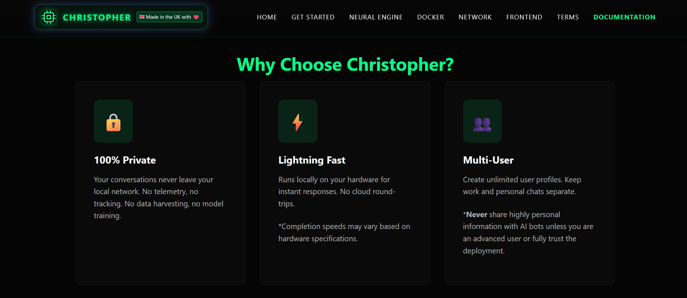
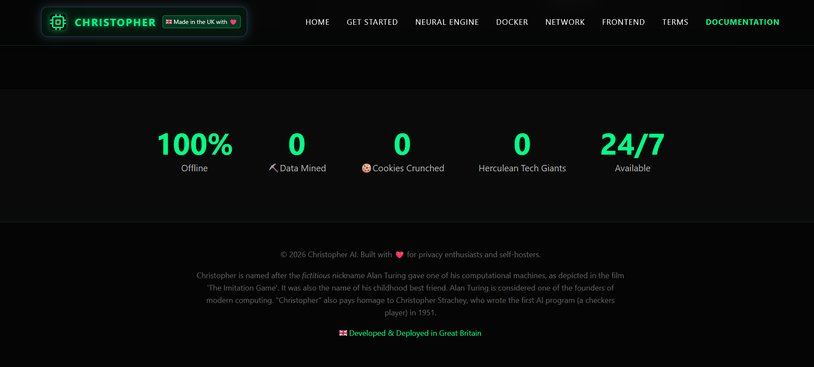
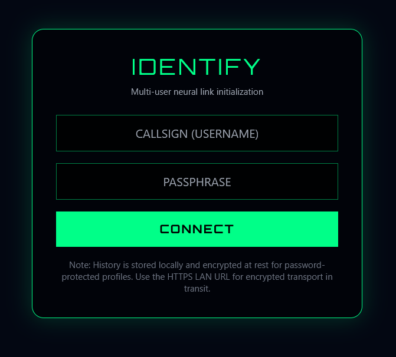
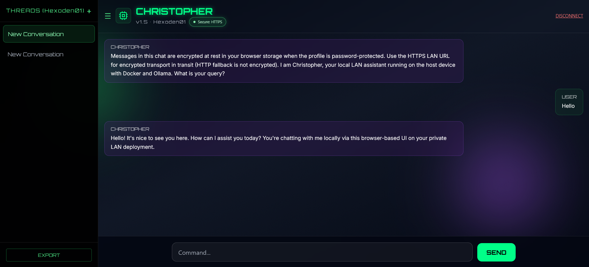

#  CHRISTOPHER AI - Neural Interface
  [](https://www.gnu.org/licenses/agpl-3.0)
  
> **"Messages are encrypted at rest in your browser storage, protected by your profile password, and designed to be temporary. Use the HTTPS LAN URL for encrypted transport in transit. Christopher runs locally on your hardware."**

Christopher is a self-hosted, multi-user cyberpunk AI chatbot powered by **Ollama** and **Next.js**. It brings the power of Large Language Models (LLMs) to your local network without sending a single byte of data to the cloud. Designed for privacy enthusiasts, developers, and home-labbers who demand sovereignty over their digital conversations.

---

## 🖥️ System Requirements

Christopher is optimized to run on consumer hardware, but performance scales with your specs.

### Minimum Specs (Basic Chat)
*   **CPU:** 4 Cores (Intel i5 / AMD Ryzen 5 or equivalent)
*   **RAM:** 8 GB (System will use swap if lower, but may be slow)
*   **Storage:** 10 GB Free Space (for Docker images + Model files)
*   **OS:** Windows 10/11, macOS 12+, or Linux (Ubuntu/Debian)
*   **Software:** Docker Desktop (Windows/Mac) or Docker Engine + Compose (Linux)

### Recommended Specs (Fast & Smooth)
*   **CPU:** 6+ Cores
*   **RAM:** 16 GB or more
*   **GPU:** NVIDIA RTX 3060 (6GB VRAM) or better *(Optional: Enables GPU acceleration in Docker)*
*   **Storage:** SSD/NVMe (Significantly faster model loading times)

> **⚠️ Note:** This project runs the AI model **locally** on your machine. Performance depends directly on your hardware. No data is sent to the cloud.

> **Model Recency Notice:** The default model (`llama3.2:1b`) has a published cutting knowledge date of **December 2023**. Date-sensitive or current-events answers can be outdated, so verify important claims with up-to-date sources.

```bash
docker compose exec -T ollama ollama show llama3.2:1b
```

Check the model metadata output for recency details when you change model versions.

> **Real-Time Retrieval Status:** Real-time web scraping/query retrieval is currently being investigated for future releases to improve date-sensitive responses. It is not enabled by default at this time.

---

## 🚀 Installation

### Prerequisites: Installing Docker

Before running Christopher, you must have Docker installed on your system. Choose the guide below for your operating system:

- **Windows:** Download and install [Docker Desktop for Windows](https://www.docker.com/products/docker-desktop/). Ensure "WSL 2 backend" is enabled during installation for best performance.
- **macOS:** Download and install [Docker Desktop for Mac](https://www.docker.com/products/docker-desktop/). Select the appropriate version for your chip (Intel or Apple Silicon).
- **Linux (Ubuntu/Debian):** Open a terminal and run the official installation script:
    
    `curl -fsSL https://get.docker.com -o get-docker.sh && sudo sh get-docker.sh`
    
    _Add your user to the docker group: `sudo usermod -aG docker $USER` (then log out and back in)._

### 1. One-Command Setup
Choose your operating system and run the matching command in the project folder:

- **Linux/macOS:**

```bash
bash ./setup.sh
```

- **Linux/macOS (visual loader mode):**

```bash
chmod +x ./setup-ui.sh
./setup-ui.sh
```

This wrapper runs setup in the background and shows a cyberpunk-style loader (smiley + sparkle + wavy progress placeholder) while preserving a developer log at `.setup-ui.log`.
In SSH or non-interactive terminals, it automatically switches to compact mode and avoids frame redraw spam in scrollback.

If auto-detect misses your network interface on macOS, pass IP manually:

```bash
./setup-ui.sh <host-ip>
```

- **Windows (PowerShell):**

```powershell
.\setup.ps1
```

- **Windows (PowerShell, visual loader mode):**

```powershell
.\setup-ui.ps1
```

The Windows loader keeps setup output in `.setup-ui.log` so developers can inspect details while users get a clean progress display.

This will:
- detect the host IP
- build and start the Docker stack
- print the secure LAN URL you can open immediately
- auto-generate HTTPS certificate files for that host IP
- auto-pull the default Ollama model (`llama3.2:1b`) if missing

### 2. Wait for Initialization
The first run may take several minutes while the AI model (~1.2 GB) downloads.

Watch progress:
`docker compose -p christopher logs -f ollama`

Confirm model availability:
`docker compose -p christopher exec -T ollama ollama list`

Look for `llama3.2:1b` in the output before first chat.

### 3. Launch Interface
Open the LAN URL printed by the setup script.

- Secure example: `https://<host-ip>:3001`
- Optional fallback: `http://<host-ip>:3002`
- No DNS setup is required.
- No hosts-file edits are required.
- Just open the IP address from any device on the same network.

Notes:
- The default access path is encrypted in transit over HTTPS using your LAN IP.
- The HTTP fallback is not encrypted in transit and is provided for compatibility/troubleshooting only.
- If you later want hostname-based HTTPS, you can add that as an advanced setup, but it is not required for the default install.
- The setup script generates a self-signed certificate for your LAN IP (`certs/server.crt` + `certs/server.key`).
- On first use, browsers will warn until each client device trusts `certs/server.crt`.

Deployment remains straightforward: run one command on the host (`bash ./setup.sh` on Linux/macOS or `./setup.ps1` on Windows), then open the printed URL on client devices.

### 4. Cross-Device Compatibility
Christopher works across Windows, macOS, Linux, Android, and iOS clients as long as:

- the device can reach the host on the same LAN,
- port `3001` is reachable from that device,
- and the device trusts the generated certificate (or the user accepts the warning).

Only the host machine runs Docker. Client devices just open the URL in a browser.

### 🔐 First Time Setup
**User Accounts**
Login: Create/select a profile with a required passphrase.
Example: Neo / CorrectHorseBatteryStaple
>Note: There is no central database. Profile metadata is stored in browser localStorage.

**Profiles**: You can create multiple profiles (e.g., "Work", "Personal", "Dev") to keep chat histories completely separate.

**Performance Expectations**
- Cold Start: The very first message may take 10-20 seconds to generate while the model loads into RAM.
- Streaming: Subsequent messages will stream instantly (tokens per second depends on CPU/GPU).

### ⚠️ Data Privacy & Impermanence
- **Encrypted at Rest**: Chat history is encrypted in your browser storage and protected by your profile password.
- **Volatility**: If you clear browser storage, switch devices, or use Incognito mode, <font color="#de7802">history can be lost</font>.
- **No Recovery**: If you forget a profile password, encrypted chat history cannot be recovered.
- **Backup**: Use the "EXPORT" button to save important conversations. Exports from password-protected profiles are encrypted (`.enc.json`).

### 🆕 Security & Deployment Highlights
- **Password-Required Profiles**: New profiles require a passphrase before chat access is granted.
- **Encrypted Chat Storage**: Password-protected profile history is encrypted at rest in browser localStorage.
- **Secure-by-Default Transport**: Use HTTPS on `:3001` as the standard LAN access path.
- **Cross-Platform Certificate Setup**: `setup.sh` and `setup.ps1` auto-generate self-signed certs for the detected host IP.
- **Fallback-Only Compatibility Path**: HTTP on `:3002` is fallback only for compatibility/troubleshooting and is not encrypted in transit.
- **Live Transport Status in UI**: Header badge shows whether the current session is on HTTPS or HTTP.

### ✨ Features
- **🔒 100% Offline**: No API keys, no cloud subscriptions, no telemetry.
- **👥 Multi-User**: Different usernames create completely separate chat histories.
- **🛡️ Security-Forward Profiles**: Password-protected profiles keep local chat storage encrypted at rest.
- **📶 Transport Awareness Badge**: Runtime header indicator shows secure HTTPS mode vs HTTP fallback mode.
- **🧵 Multi-Thread**: Click the + in the sidebar to start new topics (e.g., "Coding", "Creative Writing", "Recipes").
- **✏️ Rename Threads**: Double-click any thread name in the sidebar to rename it.
- **🎨 Cyberpunk UI**: Fully responsive, dark-mode, neon-themed interface optimized for low-light environments.
- **📱 Mobile Ready**: Access from any device on your local network (phone, tablet, laptop) using the host IP.

### � Visual Overview

#### Landing Page



#### Application Interface
**Login & Profile Setup**


**Chat Interface**


---

### �🛑 Maintenance
**Stop the Service**
To stop the AI and free up resources:
```bash
docker compose down
```
(Your downloaded models and chat history are saved in Docker volumes and will persist when you start it again.)

**Update Christopher**
```bash
docker compose pull
docker compose up -d --build
```

**Remove Completely**
```bash
docker compose down -v  
# Removes volumes (deletes all chats & models)
```

### 🆘 Troubleshooting
| Issue                       | Solution                                                                                                                                                       |
| --------------------------- | -------------------------------------------------------------------------------------------------------------------------------------------------------------- |
| "Connection Lost"           | Ensure the `christopher-ollama` container is running (`docker compose ps`). Restart with `docker compose restart`.                                             |
| Cannot Access via localhost | Use your machine's LAN IP address (e.g., `192.168.1.x`) instead. Docker networking often requires binding to `0.0.0.0` which is best accessed via the host IP. |
| Very Slow Responses         | Your computer might be using CPU instead of GPU. Ensure Docker has access to your NVIDIA GPU (requires NVIDIA Container Toolkit on Linux).                     |
| Port Conflict               | If port 3001 or 3002 is already in use, remap the `3001:443` and `3002:80` mappings in `docker-compose.yml` for the `caddy` service.                        |
| Certificate Warning         | Expected on first use. Import/trust `certs/server.crt` on each client device, or temporarily proceed through the browser warning page.                        |
| Cannot Access via IP       | Make sure you are using the LAN IP shown by the setup script, and that the `christopher-caddy` and `christopher-app` containers are running. |
| Model Not Loading / Not Found | Run `docker compose -p christopher exec -T ollama ollama pull llama3.2:1b`, then retry. Also ensure at least 5GB free disk space.                          |
| Sidebar Missing on Mobile   | Tap the ☰ icon in the top left to toggle the sidebar.                                                                                                          |

---
## 🏗️ Architecture

- Frontend: Next.js 14, React, Tailwind CSS
- AI Engine: Ollama (serving Llama 3 1B/3B Quantized)
- Deployment: Docker Compose + Caddy (LAN HTTPS reverse proxy)
- Storage: Browser localStorage (Client-side) + Docker Volumes (Server-side models)

---
## 📜 License

**Christopher AI** is licensed under the [GNU Affero General Public License v3.0](LICENSE).

### ⚠️ Important: AI Model Licensing

This software is a **wrapper** for AI models. The models themselves (e.g., Llama 3, Mistral)
are subject to their own licenses. You are responsible for ensuring compliance with
the model provider's terms when downloading and using any AI model.

See [NOTICE](NOTICE) for details on third-party components.

### 💬 Maintainer Note

This is the first project I have felt confident enough to publish on GitHub.
I am still learning, and I welcome respectful feedback, suggestions, and improvements.

### 🇬🇧 Made in the UK with ♥️

Built for privacy enthusiasts and self-hosters.

---

Christopher is named after the fictitious nickname Alan Turing gave one of his computational machines, as depicted in the film 'The Imitation Game'. It was also the name of his childhood best friend. Alan Turing is considered one of the founders of modern computing. "Christopher" also pays homage to Christopher Strachey, who wrote the first AI program (a checkers player) in 1951.
